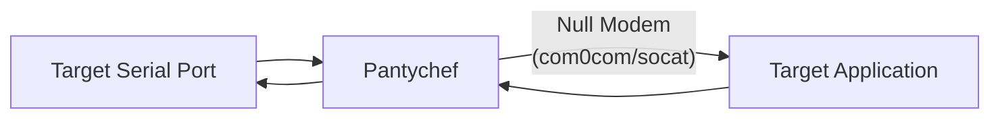

# Pantychef

Snoop on bi-directional communication between the target serial port and the target application, used in conjunction with a null modem.

```
> npm install --global @u1f992/pantychef
> pantychef --target-path=COM3 --target-baud-rate=115200 --passthru-path=COM6 --input-type=binary --output-type=text
```


