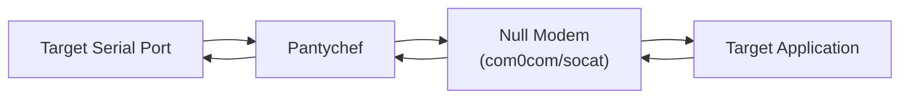

# Pantychef

Snoop on bi-directional communication between the target serial port and the target application, used in conjunction with a null modem.

```mermaid
flowchart LR
    A["Target Serial Port"] --> B["Pantychef"]
    B --> C["Null Modem<br>(com0com/socat)"]
    C --> D["Target Application"]
    D --> C
    C --> B
    B --> A
```
